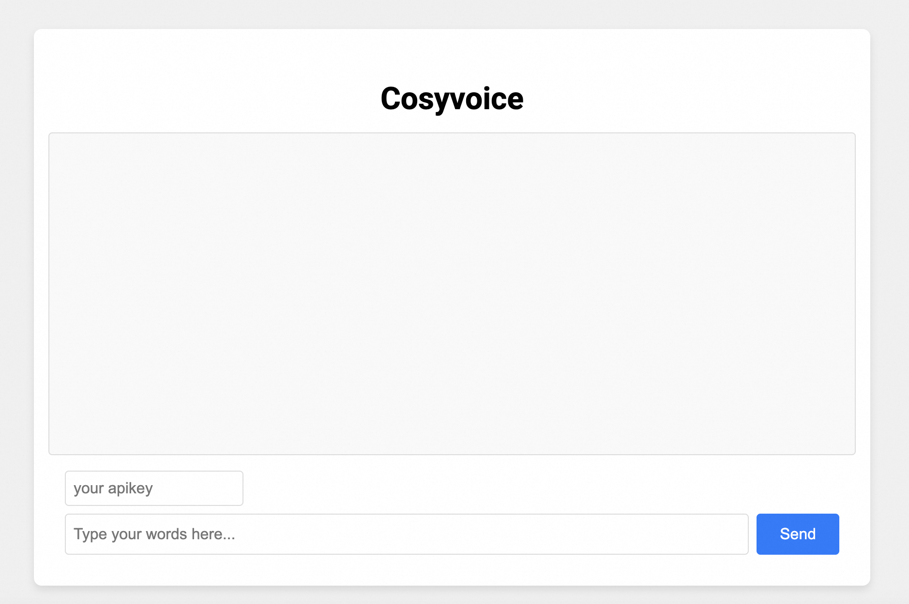

# Cosyvoice语音合成Javascript示例

简体中文 | [English](./README_EN.md)

本示例演示如何通过 javascript 接入百炼平台的 cosyvoice 语音合成服务。示例同时提供一个播放器模块，可以在浏览器中播放合成的流式音频。

## 前提条件

#### 配置阿里云百炼API-KEY

在运行本示例之前，您需要开通阿里云账号、获得阿里云百炼API_KEY，并进行必要的环境配置。有关API-KEY的详细配置步骤请参考：[PREREQUISITES.md](../../../PREREQUISITES.md)

## 运行示例

本目录展示了前端集成Cosyvoice的示例，需要在本地搭建http服务支持通过浏览器导入本地js脚本。

请在本目录运行一个http服务：
```
python -m http.server 9000
```

之后您可以在浏览器输入`http://localhost:9000`打开测试网页。输入apikey、待合成文本，并点击`Send`按钮合成文本并播放。



### 关于流式输入说明

关于流式输入，可以通过调用多次`sendText`实现。本示例中不进行演示。

### 关于播放器的说明

在`audio_player.js`中，我们使用 Web Audio API 开发了 PCMAudioPlayer 播放器播放流式PCM格式的音频，将16bit采样点转化为float写入audioBuffer播放，并且在上一段音频播放结束的onended回调中立刻播放下一段音频。
>注意⚠️ ：
>1. 使用MediaSource播放流式音频是一个更加简洁的方案，但是MediaSource不支持如下浏览器：Safari、基于Safari的iOS WebView、微信小程序。更多兼容信息参见 [MediaSource](https://developer.mozilla.org/zh-CN/docs/Web/API/MediaSource)
>2. 使用[openai-realtime-console](https://github.com/openai/openai-realtime-console/tree/websockets)中集成的wavtools在移动端和safari浏览器中播放时会有噪声。

### 关于鉴权和账号安全

在百炼 Websockets 服务中，由于 JavaScript 不支持添加自定义 HTTP Header，因此 API Key 需要通过 URL 参数进行传递以完成鉴权。

#### 安全性说明

通过 URL 添加永久有效的 API Key 进行鉴权的方式虽然简单易用，但在安全性方面存在一定的风险：
- API Key 暴露风险：API Key 直接暴露在前端代码或 URL 中，可能被恶意用户通过浏览器开发者工具、网络抓包或日志记录等方式轻易获取。
- 潜在后果：一旦 API Key 泄露，攻击者可以利用其长期访问您的服务，可能导致数据泄露、资源滥用或其他安全问题。

#### 免责声明
请注意，使用此方式接入服务时，您需自行承担因 API Key 泄露而导致的一切后果。我们强烈建议您采取以下措施以提升安全性：

1. 避免直接暴露永久 API Key：考虑使用短期有效的动态令牌（如 JWT）代替永久 API Key，并通过后端生成和分发这些令牌。
2. 启用 HTTPS：确保所有通信都通过加密的 HTTPS 连接进行，以防止 API Key 在传输过程中被窃取。
限制 API Key 权限范围：为 API Key 设置最小权限，确保即使泄露也不会对系统造成严重影响。


如果您对安全性有更高要求，建议部署转发服务。