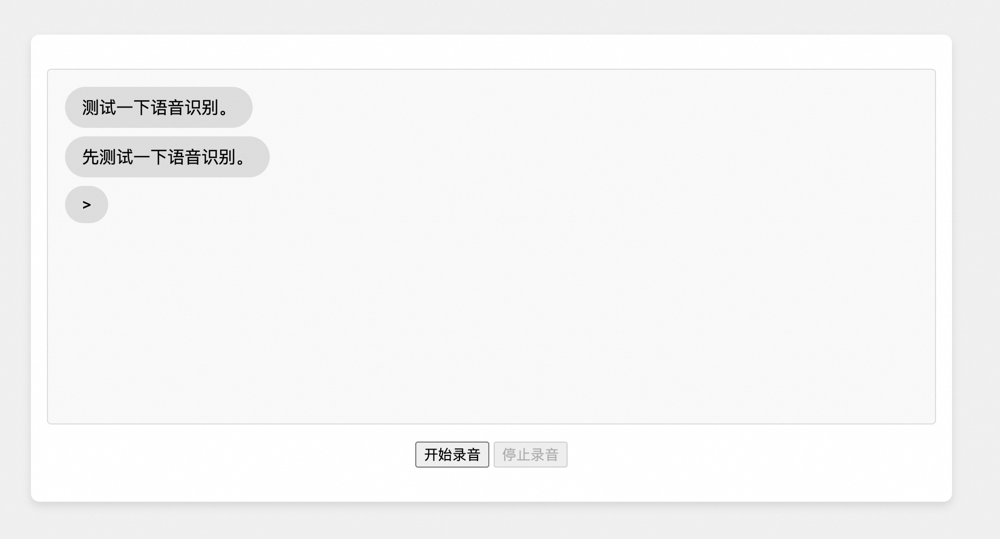

# 在网页中录音并进行语音识别
本项目在本地搭建了http服务和websocket语音识别服务，在网页中录音并实时显示识别结果。您可以参考这个示例项目在自己的网页中加入语音识别功能。

## 前提条件

#### 安装 Python 依赖

阿里云百炼SDK运行环境需要Python3.8及以上版本。
运行本场景DEMO依赖的环境可以通过[PyPI](https://pypi.org/)安装。

您可以使用`pip install -r requirements.txt` 命令来安装本文件夹下的requirements依赖文件。或者手动安装下方的依赖。

- 导入百炼SDK
```commandline
pip3 install dashscope //安装阿里云百炼SDK
pip3 install websockets //安装websocket服务依赖
```

#### 配置阿里云百炼API-KEY
在使用百炼SDK进行语音识别之前，您需要先在阿里云控制台创建语音识别服务并获取API-KEY。
- 在[百炼控制台](https://bailian.console.aliyun.com/)界面右上角头像位置，鼠标悬浮后，展示API-KEY，点击后进入API-KEY管理页面。
- 点击【创建新的API-KEY】，会自动创建一条属于这个账号的API-KEY。列表上展示API-KEY密文，点击【查看】可以看到API-KEY的明文信息。请注意保存API-KEY的明文信息，后续使用API-KEY时需要用到。
- 更多百炼配置信息请参考：[PREREQUISITES.md](../../../../PREREQUISITES.md)

## 运行示例

本目录展示了前后端分离的语音识别示例，通过websocket连接前后端，以及如何处理实时更新识别结果。


当您点击“开始录音”按钮后，网页会和python websocket服务创建连接，开始从麦克风录制音频，并将录音实时的发送给websocket服务。服务器会调用paraformer-realtime-v2语音识别模型，并将实时语音识别结果返回给网页展示。实时识别每一句的结果会在同一行内不断更新，直到分句后进入下一行。

首先，请运行`demo_server.py`，默认会在本地的9090端口运行websocket服务。
```
python demo_server.py
```

之后请在本目录运行一个http服务，用于支持通过浏览器访问当前目录的文件。
```
python -m http.server 9000
```

之后您可以在浏览器输入`http://localhost:9000`打开测试网页。输入提问并点击`开始录音`按钮发送消息后对麦克风说话。

