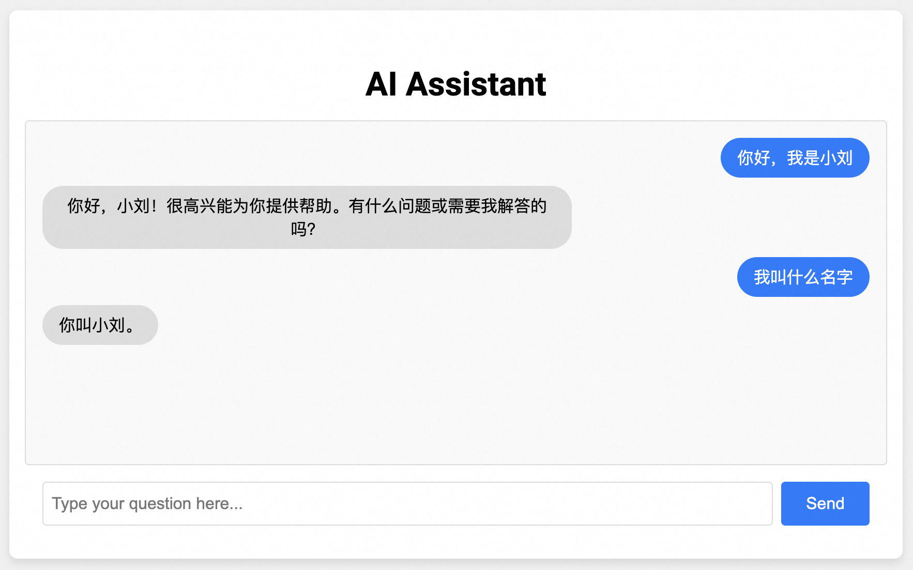

# AI Assistant网页版语音助手

简体中文 | [English](./README_EN.md)

AI Assistant网页版模拟了目前主流的大模型网站提供的交互服务，在多轮对话的基础上增加了实时、低延迟朗读大模型输出的能力。您可以参考这个示例项目搭建自己的Chatgpt网站。

## 前提条件

#### 安装 Python 依赖

阿里云百炼SDK运行环境需要Python3.8及以上版本。
运行本场景DEMO依赖的环境可以通过[PyPI](https://pypi.org/)安装。

您可以使用`pip install -r requirements.txt` 命令来安装本文件夹下的requirements依赖文件。或者手动安装下方的依赖。

- 导入百炼SDK
```commandline
pip3 install dashscope //安装阿里云百炼SDK
pip3 install websockets //安装websocket服务依赖
```

#### 配置阿里云百炼API-KEY

在运行本示例之前，您需要开通阿里云账号、获得阿里云百炼API_KEY，并进行必要的环境配置。有关API-KEY的详细配置步骤请参考：[PREREQUISITES.md](../../../../PREREQUISITES.md)

## 运行示例

本目录展示了前后端分离的AI Assistant示例，通过websocket连接前后端。


当您点击Send按钮后，网页会和python websocket服务创建连接，将文本框中的输入发送到服务器。服务器会调用qwen大模型和cosyvoice语音大模型，并将回答的文本片段和语音合成的PCM格式音频片段实时返回给网页播放。
再上一段音频播放时如果您点击了Send按钮，会打断上一段音频，开始下一段语音合成和播放。

首先，请运行`demo_server.py`，默认会在本地的11111端口运行websocket服务。
```
python demo_server.py
```

之后请在本目录运行一个http服务，用于支持通过浏览器访问当前目录的文件。
```
python -m http.server 9000
```

之后您可以在浏览器输入`http://localhost:9000`打开测试网页。输入提问并点击`Send`按钮发送消息后，会自动调用百炼SDK的接口，并在收到大模型的回复并且立刻朗读。

本示例可以支持多轮交互，默认缓存十轮历史对话消息。



### 关于播放器的说明

在`audio_player.js`中，我们使用 Web Audio API 开发了 PCMAudioPlayer 播放器播放流式PCM格式的音频，将16bit采样点转化为float写入audioBuffer播放，并且在上一段音频播放结束的onended回调中立刻播放下一段音频。
>注意⚠️ ：
>1. 使用MediaSource播放流式音频是一个更加简洁的方案，但是MediaSource不支持如下浏览器：Safari、基于Safari的iOS WebView、微信小程序。更多兼容信息参见 [MediaSource](https://developer.mozilla.org/zh-CN/docs/Web/API/MediaSource)
>2. 使用[openai-realtime-console](https://github.com/openai/openai-realtime-console/tree/websockets)中集成的wavtools在移动端和safari浏览器中播放时会有噪声。