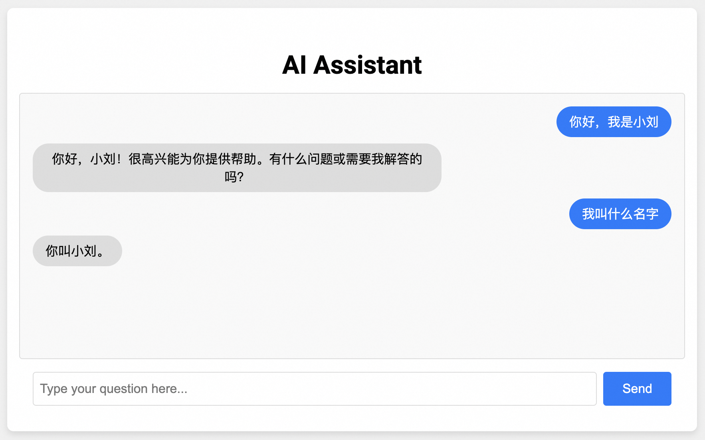

# AI Assistant Web Version Voice Assistant

English | [简体中文](./README.md)

The web version of AI Assistant simulates the interactive services provided by mainstream large model websites, adding real-time, low-latency text-to-speech capabilities for large model outputs. You can refer to this sample project to build your own ChatGPT website.

## Prerequisites

#### Install Python Dependencies
The Aliyun Bailian SDK requires Python 3.8 or higher.  
The environment dependencies for this scenario demo can be installed via [PyPI](https://pypi.org/).

You can use the `pip install -r requirements.txt` command to install the dependencies in this folder. Or manually install the following dependencies:

- Import Bailian SDK
```commandline
pip3 install dashscope // Install Aliyun Bailian SDK
pip3 install websockets // Install websocket service dependencies
```

Configure Aliyun Bailian API-KEY
Before running this example, you need to create an Aliyun account, obtain an Aliyun Bailian API_KEY, and complete necessary environment configurations. For detailed API-KEY configuration steps, please refer to: [PREREQUISITES.md](../../../../PREREQUISITES.md)

## Run Example

This directory demonstrates a front-end/back-end separated AI Assistant example connected via websocket.

When you click the Send button, the web page establishes a connection with the Python websocket service, sending the input text to the server. The server calls the Qwen large model and CosyVoice speech model, returning text fragments and PCM audio fragments in real-time for web playback.
If you click Send during audio playback, the previous audio will be interrupted, and a new voice synthesis and playback will start.

First, run `server.py`, which defaults to running the websocket service on port 11111 locally.
```
python server.py
```

Then run an HTTP service in this directory to support browser access to the files:
```
python -m http.server 9000
```

You can then open the test page in your browser by entering `http://localhost:9000`. After entering a question and clicking the `Send` button, the system will automatically call the Bailian SDK interface and immediately read the large model's response.

This example supports multi-turn interactions, defaulting to caching ten rounds of conversation history by default.



### About the Player Implementation

In `audio_player.js`, we developed a PCMAudioPlayer using Web Audio API to play streaming PCM format audio. It converts 16-bit samples to float values, writes them into audioBuffer for playback, and immediately plays the next audio segment when the previous one ends via the onended callback.

>Note ⚠️:
>1. Using MediaSource for streaming audio is a simpler solution, but it's not supported in: Safari, Safari-based iOS WebView, and WeChat Mini Programs. More compatibility information see MediaSource
>2. Using openai-realtime-console with wavtools may produce noise during playback on mobile devices and Safari browsers.