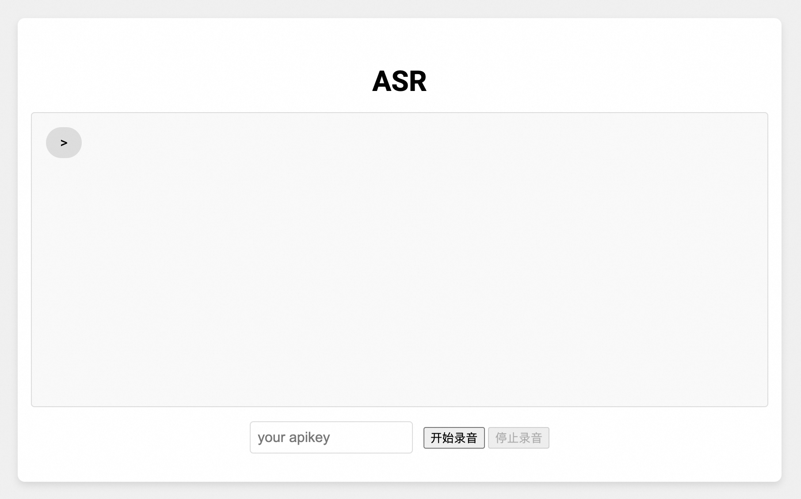

# Paraformer实时语音识别Javascript示例
本示例演示如何通过 javascript 接入百炼平台的 paraformer 实时语音识别服务。示例同时提供一个录音器模块，可以在浏览器中录制音频、调用语音识别服务并显示识别结果。

## 前提条件

#### 配置阿里云百炼API-KEY
在使用百炼SDK进行语音识别之前，您需要先在阿里云控制台创建语音识别服务并获取API-KEY。
- 在[百炼控制台](https://bailian.console.aliyun.com/)界面右上角头像位置，鼠标悬浮后，展示API-KEY，点击后进入API-KEY管理页面。
- 点击【创建新的API-KEY】，会自动创建一条属于这个账号的API-KEY。列表上展示API-KEY密文，点击【查看】可以看到API-KEY的明文信息。请注意保存API-KEY的明文信息，后续使用API-KEY时需要用到。
- 更多百炼配置信息请参考：[PREREQUISITES.md](../../../../PREREQUISITES.md)

## 运行示例

本目录展示了前端集成Paraformer的示例，需要在本地搭建http服务支持通过浏览器导入本地js脚本。

请在本目录运行一个http服务：
```
python -m http.server 9000
```

之后您可以在浏览器输入`http://localhost:9000`打开测试网页。输入apikey，并点击`开始录音`按钮发送消息后对麦克风说话，点击`停止录音`按钮结束录音。



### 关于录音的说明

在`audio_recorder.js`中，我们使用 Web Audio API 开发了 PCMAudioRecorder 录制PCM格式的音频，并通过 AudioWorkletNode 异步将采样点从浮点数转化为16bit的Int16Array并通过回调返回。buffer默认大小为1600采样点，即100ms。


### 关于鉴权和账号安全

在百炼 Websockets 服务中，由于 JavaScript 不支持添加自定义 HTTP Header，因此 API Key 需要通过 URL 参数进行传递以完成鉴权。

#### 安全性说明

通过 URL 添加永久有效的 API Key 进行鉴权的方式虽然简单易用，但在安全性方面存在一定的风险：
- API Key 暴露风险：API Key 直接暴露在前端代码或 URL 中，可能被恶意用户通过浏览器开发者工具、网络抓包或日志记录等方式轻易获取。
- 潜在后果：一旦 API Key 泄露，攻击者可以利用其长期访问您的服务，可能导致数据泄露、资源滥用或其他安全问题。

#### 免责声明
请注意，使用此方式接入服务时，您需自行承担因 API Key 泄露而导致的一切后果。我们强烈建议您采取以下措施以提升安全性：

1. 避免直接暴露永久 API Key：考虑使用短期有效的动态令牌（如 JWT）代替永久 API Key，并通过后端生成和分发这些令牌。
2. 启用 HTTPS：确保所有通信都通过加密的 HTTPS 连接进行，以防止 API Key 在传输过程中被窃取。
限制 API Key 权限范围：为 API Key 设置最小权限，确保即使泄露也不会对系统造成严重影响。


如果您对安全性有更高要求，建议部署转发服务。