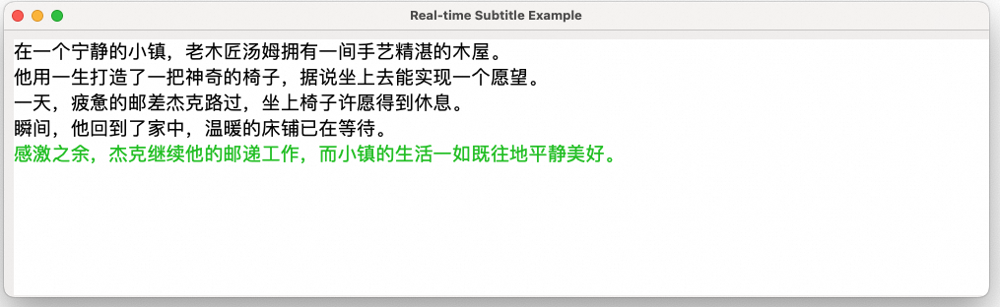

[comment]: # (title and brief introduction of the sample)
## 按句展示语音合成字幕
流式输入语音合成字幕项目是通过将大语言模型生成的文本进行语音合成，并同步显示字幕的一种技术实现。该项目结合了语音合成技术与字幕显示技术，适用于多种场景，如视频配音、有声读物、在线教育等需要文字转语音同步展示的场景。
<!--
[comment]: # (list of scenarios of the sample)
### :point_right: 适用场景

| 应用场景         | 典型用法   | 使用说明                |
|--------------|--------|---------------------|
 -->


## Python

[comment]: # (prerequisites)
### :point_right: 前提条件

1. #### 配置阿里云百炼API-KEY

    在运行本示例之前，您需要开通阿里云账号、获得阿里云百炼API_KEY，并进行必要的环境配置。有关API-KEY的详细配置步骤请参考：[PREREQUISITES.md](../../../../PREREQUISITES.md)

1. #### 安装Python依赖

    阿里云百炼SDK运行环境需要Python 3.8及以上版本。您可以使用以下命令来安装本示例的依赖：
    ```commandline
    pip3 install -r requirements.txt
    ```

[comment]: # (how to run the sample and expected results)
### :point_right: 运行示例


```commandline
python3 read_aloud_the_text_generated_by_llm_and_display_subtitles.py
```

本目录下提供了调用通义Speech流式输入流式输出语音合成及通义千问两个服务接口，实现低延迟、实时展示语音合成字幕示例。

本示例提供了一个简化的GUI 界面，用来展示字幕。



示例将LLM合成的文本流实时提交到任务队列中，并且按照中文句号作为字幕换行符发送句子结束信号到任务队列。

任务处理线程调用流式输入流式输出语音合成服务将队列中的文本朗读，并通过回调将合成的音频流和句子结束信号保存到SubtitlePlayer的音频缓存队列中。

SubtitlePlayer是一个包含实时音频播放器的简单GUI界面。它会扫描音频缓存队列，立刻播放音频，直到遇到句子结束信号，并且等待当前音频朗读结束。


**请注意：**
- 播放：
    为了方便演示，示例中集成了简单的录音和播放功能。并且在每一行文本朗读结束之后播放器会阻塞主线程等待朗读结束，因此会阻塞主线程获取音频。
    您可以灵活在业务中调整播放器策略，比如采用其他可以在线程中等待的播放器。


[comment]: # (technical support of the sample)
### :point_right: 技术支持

