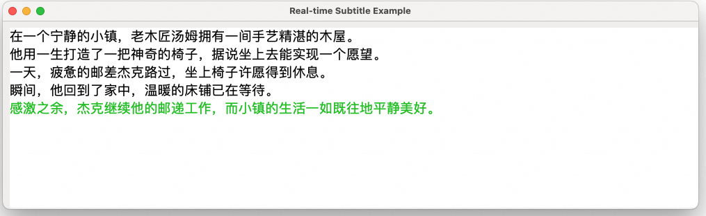

## Display Subtitles Sentence by Sentence

English | [简体中文](./README.md)

The streaming input speech synthesis subtitle project is a technical implementation that synthesizes speech from text generated by large language models and synchronizes subtitles. This project combines speech synthesis technology with subtitle display technology, suitable for various scenarios such as video dubbing, audiobooks, online education, and other contexts requiring synchronized text-to-speech presentation.

### :point_right: Applicable Scenarios

| Application Scenario | Typical Usage | Usage Instructions                |
|--------------|--------|---------------------|


## Python

### :point_right: Prerequisites

1. #### Configure Alibaba Cloud Tongyi Lab API-KEY

    Before running this example, you need to activate an Alibaba Cloud account, obtain the Tongyi Lab API-KEY, and perform necessary environment configurations. For detailed API-KEY configuration steps, please refer to: [PREREQUISITES.md](../../../../PREREQUISITES.md)

1. #### Install Python Dependencies

    The Alibaba Cloud Tongyi Lab SDK requires Python 3.8 or higher. You can install the dependencies for this example using the following command:
    ```commandline
    pip3 install -r requirements.txt
    ```

### :point_right: Run Example

```commandline
python3 read_aloud_the_text_generated_by_llm_and_display_subtitles.py
```

This directory provides an example that calls the Tongyi Speech streaming input/output text-to-speech synthesis and Tongyi Qianwen services interfaces to achieve low-latency, real-time subtitle display.

The example provides a simplified GUI interface to display subtitles.



The example streams text generated by the LLM to a task queue in real-time, using Chinese periods as subtitle line breaks to send sentence-end signals to the task queue.

The task processing thread calls the streaming input/output text-to-speech synthesis service to read text from the queue and saves the synthesized audio stream and sentence-end signals to the SubtitlePlayer's audio buffer queue via callbacks.

SubtitlePlayer is a simple GUI interface containing a real-time audio player. It scans the audio buffer queue to immediately play audio until encountering a sentence-end signal, then waits for the current audio playback to finish.

**Note:**

- Playback:
    For demonstration purposes, the example includes simple recording and playback functions. After each line of text is read, the player blocks the main thread to wait for playback completion, which may block the main thread from acquiring audio.
    You can adjust the player strategy flexibly in your business logic, such as using a player that supports waiting in threads.


[comment]: # (technical support of the sample)
### :point_right: Technical Support
