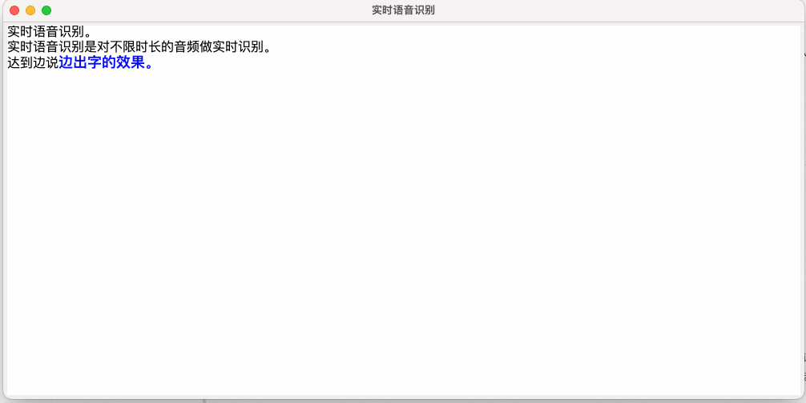

[comment]: # (title and brief introduction of the sample)
## 语音识别并实时上屏

本示例展示了通过调用百炼平台的 Gummy 实时语音翻译模型结果中word字段和stash字段的使用方法，并且实现低延迟、实时的语音识别字幕。

[comment]: # (list of scenarios of the sample)
### :point_right: 适用场景

| 应用场景           | 典型用法 | 使用说明                 |
|----------------| ----- |----------------------|
| **实时字幕**   | 实时字幕上屏 | *实时识别麦克风音频并实时上屏* |

[comment]: # (prerequisites)
### :point_right: 前提条件

1. #### 配置阿里云百炼API-KEY

    在运行本示例之前，您需要开通阿里云账号、获得阿里云百炼API_KEY，并进行必要的环境配置。有关API-KEY的详细配置步骤请参考：[PREREQUISITES.md](../../../../PREREQUISITES.md)

2. #### 安装Python依赖

    阿里云百炼SDK运行环境需要Python 3.8及以上版本。您可以使用以下命令来安装本示例的依赖：
    ```commandline
    pip3 install -r requirements.txt
    ```

[comment]: # (how to run the sample and expected results)
### :point_right: 运行示例
您可以使用以下命令运行本示例：

```commandline
python3 run.py
```
在示例运行后，将会开始通过麦克风录制语音并识别，打开一个简单的GUI界面，用来动态显示实时识别结果。



SubtitleFrame是双语字幕GUI界面，他会扫描队列中的语音识别结果并追加显示到界面上。其中黑色文本为已固定词汇和句子（fixed），蓝色文本为未固定的词汇，这一部分文本可能会随着识别变化。

关于如何正确识别结果的解析并实现最低延迟的上屏，请参考`update_text`函数。

[comment]: # (technical support of the sample)
### :point_right: 技术支持


