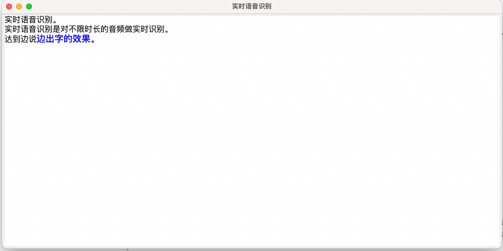

## Real-time Speech Recognition and On-screen Display

English | [简体中文](./README.md)

This example demonstrates the usage of the `word` and `stash` fields from the Gummy real-time speech translation model on the Bailian platform, achieving low-latency, real-time speech recognition subtitles.

### :point_right: Applicable Scenarios

| Application Scenario | Typical Usage | Usage Instructions                 |
|----------------------|---------------|------------------------------------|
| **Real-time Subtitles** | Real-time subtitle display | *Real-time recognition of microphone audio and on-screen display* |

### :point_right: Prerequisites

1. #### Configure Aliyun Bailian API-KEY

   Before running this example, you need to create an Aliyun account, obtain the Bailian API_KEY, and complete necessary environment configurations. For detailed API-KEY setup steps, refer to: [PREREQUISITES.md](../../../../PREREQUISITES.md)

2. #### Install Python Dependencies

    The Aliyun Bailian SDK requires Python 3.8 or higher. Use the following command to install dependencies for this example:
    ```commandline
    pip3 install -r requirements.txt
    ```

### :point_right: Run the Example

Use the following command to execute this example:

```commandline
python3 run.py
```

After execution, the system will start recording audio via microphone and displaying results in a GUI interface.



SubtitleFrame is a bilingual subtitle GUI interface that scans the queue for speech recognition results and appends them to the display. Black text represents fixed vocabulary/sentences, while blue text indicates tentative words that may change during recognition.

For implementation details of result parsing and minimum latency display, refer to the `update_text` function.

[comment]: # (technical support of the sample)
### :point_right: Technical Support
