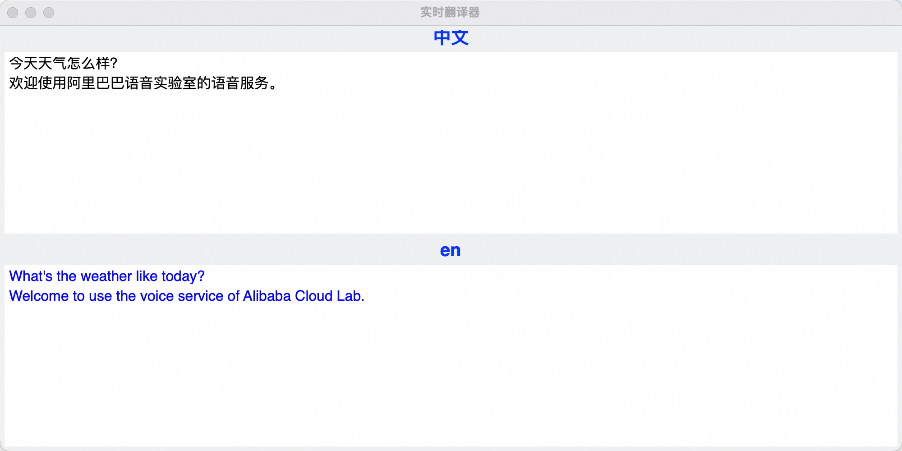

## Real-time Chinese to English Speech Translation and Playback

English | [简体中文](./README.md)

This example demonstrates the integration of the Gummy real-time speech translation model and Cosyvoice streaming speech synthesis model on the Bailian platform, achieving low-latency simultaneous interpretation with real-time bilingual subtitles.

### :point_right: Applicable Scenarios

| Application Scenario | Typical Usage | Usage Instructions                 |
|----------------------|---------------|------------------------------------|
| **Real-time Translation** | Simultaneous interpretation, real-time bilingual subtitles | *Translate audio/video files and display/read aloud translated results* |

### :point_right: Prerequisites

1. #### Configure Aliyun Bailian API-KEY

    Before running this example, you need to create an Aliyun account, obtain the Bailian API_KEY, and complete necessary environment configurations. For detailed API-KEY setup steps,  refer to: [PREREQUISITES.md](../../../../PREREQUISITES.md)

2. #### Install Python Dependencies

    The Aliyun Bailian SDK requires Python 3.8 or higher. Use the following command to install dependencies for this example:
    ```commandline
    pip3 install -r requirements.txt
    ```

### :point_right: Run the Example
Use the following command to execute this example:

```commandline
python3 run.py
```

After execution, the system will:

1. Record speech via microphone and translate it to English
2. Synthesize the translated text to speech using the longanhuan voice
3. Display real-time bilingual subtitles in a GUI interface



The example implements two parallel threads for audio processing:
- Speech Translation Thread: In a while-loop, captures audio from microphone, sends to Bailian's real-time translation service, and stores callback results in a queue.
- Speech Synthesis Thread: In a while-loop, retrieves translation results from the queue, generates audio via streaming synthesis, and plays the synthesized speech.

SubtitleFrame is a bilingual subtitle GUI interface that scans the queue for text and appends it to the display.

[comment]: # (technical support of the sample)
### :point_right: Technical Support
