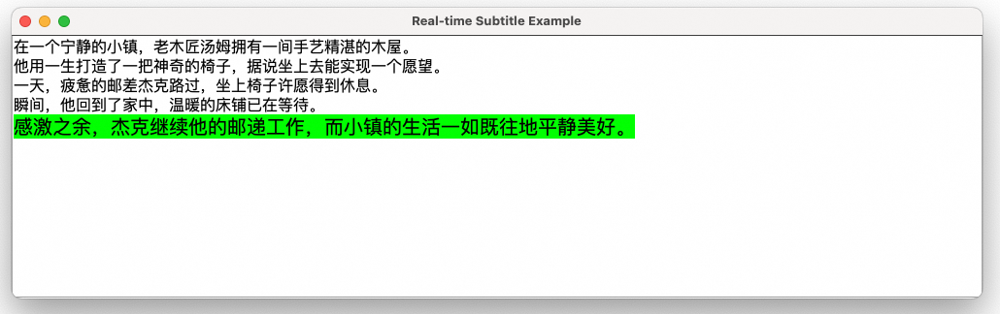

## 按句展示语音合成字幕
流式输入语音合成字幕项目是通过将大语言模型生成的文本进行语音合成，并同步显示字幕的一种技术实现。该项目结合了语音合成技术与字幕显示技术，适用于多种场景，如视频配音、有声读物、在线教育等需要文字转语音同步展示的场景。

## 前提条件
本目录下提供了调用通义Speech流式输入流式输出语音合成及通义千问两个服务接口，实现低延迟、实时展示语音合成字幕示例。

本示例提供了一个简化的GUI 界面，用来展示字幕。



示例将LLM合成的文本流实时提交到任务队列中，并且按照中文句号作为字幕换行符发送句子结束信号到任务队列。

任务处理线程调用流式输入流式输出语音合成服务将队列中的文本朗读，并通过回调将合成的音频流和句子结束信号保存到SubtitlePlayer的音频缓存队列中。

SubtitlePlayer是一个包含实时音频播放器的简单GUI界面。它会扫描音频缓存队列，立刻播放音频，直到遇到句子结束信号，并且等待当前音频朗读结束。


**请注意：**  
- 播放：
    为了方便演示，示例中集成了简单的录音和播放功能。并且在每一行文本朗读结束之后播放器会阻塞主线程等待朗读结束，因此会阻塞主线程获取音频。
    您可以灵活在业务中调整播放器策略，比如采用其他可以在线程中等待的播放器。

### 安装 Java 依赖

阿里云百炼SDK运行环境需要Java8及以上版本，SDK版本请参考[Maven](https://mvnrepository.com/artifact/com.alibaba/dashscope-sdk-java)。

运行本场景DEMO依赖的环境可以通过XML/Gradle安装。

#### 使用 Maven

在你的 `pom.xml` 文件中添加以下依赖项：

```xml
<!-- https://mvnrepository.com/artifact/com.alibaba/dashscope-sdk-java -->
<dependency>
    <groupId>com.alibaba</groupId>
    <artifactId>dashscope-sdk-java</artifactId>
    <version>the-latest-version</version>
</dependency>
<!-- 引入jlayer用于解码mp3音频格式 -->
<dependency>
    <groupId>javazoom</groupId>
    <artifactId>jlayer</artifactId>
    <version>1.0.1</version>
</dependency>  
```
#### 使用 Gradle

在你的项目的 build.gradle 文件中添加以下依赖项：

```gradle
// https://mvnrepository.com/artifact/com.alibaba/dashscope-sdk-java
implementation group: 'com.alibaba', name: 'dashscope-sdk-java', version: 'the-latest-version'
implementation group: 'javazoom', name: 'jlayer', version: '1.0.1'
```


### 配置阿里云百炼API-KEY
在使用百炼SDK进行语音识别之前，您需要先在阿里云控制台创建语音识别服务并获取API-KEY。
- 在[百炼控制台](https://bailian.console.aliyun.com/)界面右上角头像位置，鼠标悬浮后，展示API-KEY，点击后进入API-KEY管理页面。
- 点击【创建新的API-KEY】，会自动创建一条属于这个账号的API-KEY。列表上展示API-KEY密文，点击【查看】可以看到API-KEY的明文信息。请注意保存API-KEY的明文信息，后续使用API-KEY时需要用到。
- 更多百炼配置信息请参考：[PREREQUISITES.md](../../../../../PREREQUISITES.md)
