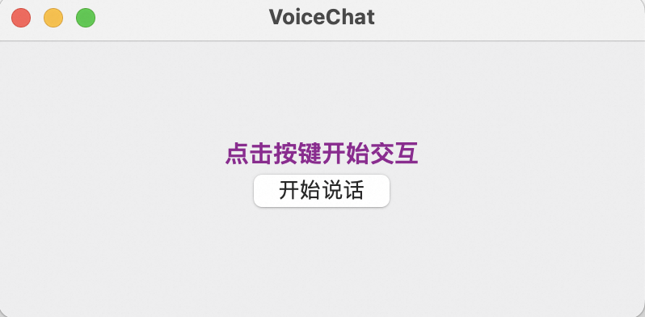
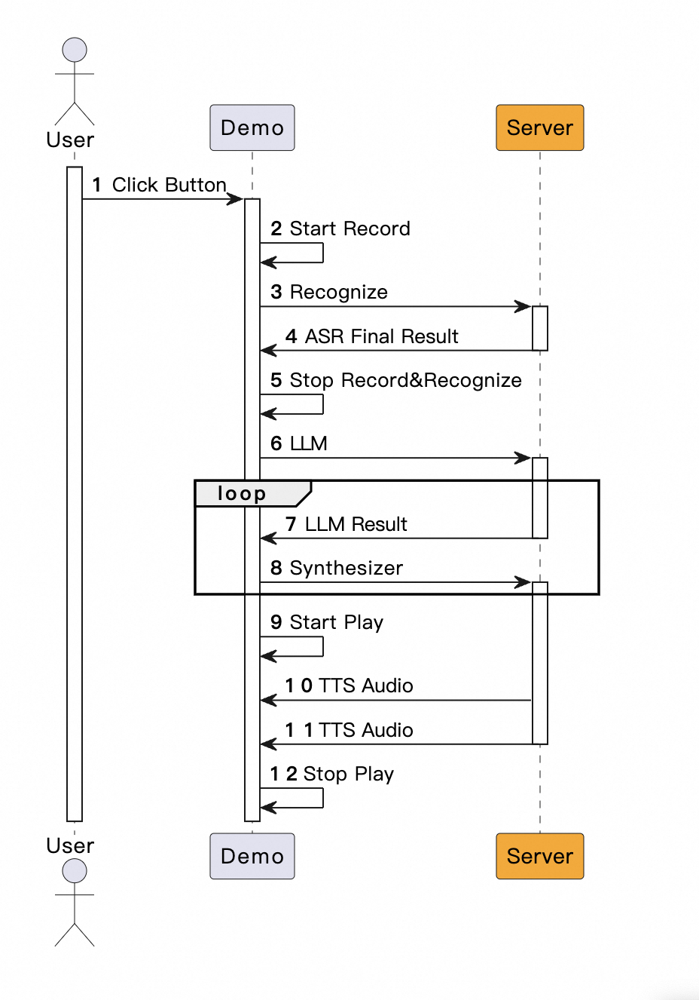

## Voice Chat 
Voice Chat是目前最火热的语音交互方式。结合文本大模型语音理解能力，实现语音进语音的交互模式。

Voice Chat可以应用于数字人、在线教育、智能客服等实时语音交互的场景。

## 前提条件
本目录下下提供了调用通义Speech语音识别、语音合成以及通义千问三个服务接口，实现的Voice Chat 场景示例。


### 安装 Python 依赖

阿里云百炼SDK运行环境需要Python3.8及以上版本。
运行本场景DEMO依赖的环境可以通过[PyPI](https://pypi.org/)安装。

您可以使用`pip install -r requirements.txt` 命令来安装本文件夹下的requirements依赖文件。或者手动安装下方的依赖。


- 导入百炼SDK
```commandline
pip3 install dashscope //安装阿里云百炼SDK
```


- 三方SDK
```commandline
pip3 install pyaudio //用于实时播放音频
pip3 install ffmpeg-python //python的ffmpeg绑定, 用于实时解码mp3音频
pip3 install sounddevice
pip3 install wxPython //GUI框架
```
在安装ffmpeg-python时请参考对应[官方文档](https://github.com/kkroening/ffmpeg-python)安装ffmpeg


### 配置阿里云百炼API-KEY
在使用百炼SDK进行语音识别之前，您需要先在阿里云控制台创建语音识别服务并获取API-KEY。
- 在[百炼控制台](https://bailian.console.aliyun.com/)界面右上角头像位置，鼠标悬浮后，展示API-KEY，点击后进入API-KEY管理页面。
- 点击【创建新的API-KEY】，会自动创建一条属于这个账号的API-KEY。列表上展示API-KEY密文，点击【查看】可以看到API-KEY的明文信息。请注意保存API-KEY的明文信息，后续使用API-KEY时需要用到。
- 更多百炼配置信息请参考：[PREREQUISITES.md](../../../../../PREREQUISITES.md)


### 运行
```commandline
python voice_chat_demo.py
```

本示例提供了一个简化的GUI 界面，用来触发交互。点击button后，会自动调用百炼SDK的接口，实现语音交互。



本示例调用了实时语音识别服务，通过检测SpeechEnd来实现语音自动判停。示例UI会block等待识别结束，允许下一次点击收音。

程序调用过程为：




**请注意：** 
- 回调方式：
    
  示例展示的是一种简单的调用过程，为了方便演示，识别结束的回调通过Event通知主线程，故主线程会block等待识别结束。 在您的实际应用中，请根据实际情况选择合适的回调方式。

  或者您可以不使用自动的方式结束录音和识别，而通过主动触发的方式实施。
- 录音和播放：
    
    为了方便演示，示例中集成了简单的录音和播放功能。您可以灵活在业务中进行调整，比如通过流的方式从您的客户端输入输出流式音频。


